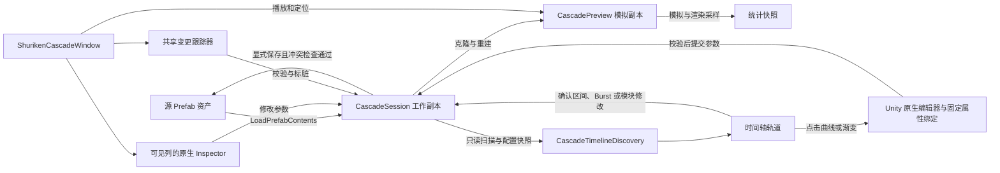

# Shuriken Cascade Editor：当前结构与设计

本文依据当前源码整理，记录截至 2026-09-15 的实现。面向后续维护和扩展；操作说明见 [README](README.md)。文中“当前实现”不等同于最初计划中的所有预期能力。

## 1. 定位与约束

编辑器完成以下闭环：打开特效 Prefab → 编辑工作副本 → 独立实时预览 → 显式保存回原 Prefab。

目标环境为 Unity 2022.3.37f1。编辑器实现位于 `Assets/Bladesero/ShurikenCascade/Editor`，程序集 `ShurikenCascade.Editor` 仅在 Editor 平台编译。Distance LOD 的组件和质量档位位于 `Runtime`，由 `ShurikenCascade.Runtime` 随 Player 编译；不修改项目渲染设置。

当前产品分工是：**Cascade 管理发射器、预览和统计；时间轴按 Emitter／已启用模块展示当前 Curve／Gradient 参数，点击打开 Unity 原生编辑器；发射区间和 Burst 直接在轨道编排，原生 Inspector 保留完整参数入口。**

核心约束：

- 仅打开 `Assets/` 下包含 ParticleSystem 的普通 Prefab；Variant、Model Prefab 暂不支持。
- 嵌套 Prefab 的参数和结构只读，限制间接修改、复制和删除。
- 粒子模块遵循 Shuriken 固定执行语义，不提供模块执行顺序拖拽。
- 编辑不会立即写入源资产；保存前检查外部修改冲突。
- 预览、相机、显示筛选、时间轴定位／范围和统计状态不进入 Prefab 数据或资产 Undo；区间／Burst 拖动确认后按参数编辑进入资产 Undo。

## 2. 界面结构

Distance LOD 配置窗口另含 emitter × 项目画质矩阵。根组件中的 `emitterQuality` 保存 emitter 引用及禁用的画质名称，未配置默认启用。`ParticleEmitterQuality.cs` 与距离控制器为同一 partial 类，距离参数应用后统一叠加画质门控；入站子发射器连接由目标 emitter 所属控制器屏蔽，避免嵌套控制器争用连接。

质量门控不改变 GameObject 激活状态。降档时不递归停止并清空，使用 `forceRenderingOff` 隔离渲染，并临时屏蔽 Stop Action；升档只恢复原先运行的普通循环 emitter。预览使用相同门控，但禁止自动播放恢复：先记录原始子发射器关系，再应用画质并排除关闭 emitter 的模拟驱动。统计仍按原始关系区分普通／事件驱动 emitter，并尊重 `forceRenderingOff`。

画质变化以 0.25 秒轮询，`RefreshQuality()` 可立即刷新且不受距离模式限制。画质名称按帧共享查询，未变化时不重复写入粒子模块。矩阵配置遵循会话 Undo／保存，复制与删除 emitter 时同步维护引用；预览画质选择不写入资产或全局画质。

```text
┌──────────────── Prefab 选择 / 保存 / 还原 / 未保存状态 ────────────────┐
│ 左侧：独立预览             │ 右侧：发射器列，横向滚动                │
│ 播放 / 暂停 / 重播 / 倍速 │ ┌─Emitter A────┐ ┌─Emitter B────┐ …    │
│ 旋转 / 平移 / 缩放        │ │名称与管理按钮│ │名称与管理按钮│      │
│ 粒子数与模拟 CPU 摘要     │ │模块复制粘贴  │ │模块复制粘贴  │      │
│                          │ │原生 Inspector│ │原生 Inspector│      │
│                          │ │独立纵向滚动  │ │独立纵向滚动  │      │
├──────────────── 时间轴：定位 / 逐帧 / A-B 循环 ─────────────────────┤
│ Emitter 文件夹 → 已启用模块 → Burst / Curve / Gradient               │
├──────────────── 性能分析：可折叠、调整高度 ─────────────────────────┤
│ 总量 / 粒子与几何估算 / CPU 采样 / 可排序的发射器表                   │
└────────────────────────────────────────────────────────────────────┘
```

入口为 `Tools/VFX/Shuriken Cascade`，也支持 Project 右键 `Open in Shuriken Cascade`。已有文档时，打开 Prefab 的拖拽只在顶部和预览区域接收，避免抢占原生 Inspector 的对象引用字段。

旧的发射器模块块列表、底部“模块参数”Tab 和“原生／自定义”编辑模式切换均已移除。

每个发射器列保留选中、重命名、显示／独显、复制发射器、删除和模块剪贴板。参数区包含原生 Transform Inspector、Particle System Inspector 及默认折叠的 Particle System Curves。Renderer 参数由粒子原生 Inspector 提供。

窗口持有当前活动发射器 `selected`、多选列表 `selectedEmitters` 和区间锚点 `selectionAnchor`；列、时间轴和性能表共用选择与高亮。列头 checkbox 独立增加／移除勾选，允许清空列表；点击层级名称建立单选，Shift 点击按发射器列顺序选择闭区间。活动项可不在勾选列表中，用于保留原生编辑和弹窗目标；列表为空时不自动重新勾选。多选当前只用于删除，不将参数编辑转为批量编辑。通过时间轴或性能表改变选择时，横向视口自动定位到对应列。模块下拉框的 `moduleIndex` 在全窗口共享，仅决定复制／粘贴类型，不控制原生模块折叠状态。

## 3. 文件与职责

以下链接相对于本文所在目录。

| 文件 | 核心职责 | 当前调用位置 |
| --- | --- | --- |
| [ShurikenCascadeWindow.cs](Editor/ShurikenCascadeWindow.cs) | 入口、窗口生命周期、布局、选择联动、结构操作入口、刷新调度、列虚拟化 | 总协调者 |
| [CascadePanelLayout.cs](Editor/CascadePanelLayout.cs) | 统一面板矩形、最小尺寸压缩、相邻分隔条尺寸分配 | Window 布局与拖动使用同一计算结果 |
| [CascadeSession.cs](Editor/CascadeSession.cs) | 工作副本、资产校验、Dirty、结构编辑、Undo、保存冲突、编译恢复 | 所有作者数据操作的中心 |
| [CascadeNativeInspector.cs](Editor/CascadeNativeInspector.cs) | 创建／复用／释放 Unity Editor，调用原生参数与曲线 GUI，隔离 GUI 状态 | 可见发射器列 |
| [CascadeNativeChangeTracker.cs](Editor/CascadeNativeChangeTracker.cs) | 共享变更检测、嵌套内容保护、对象引用校验、检测基线 | 窗口共用一份；独立适配器也可自持一份 |
| [CascadePreview.cs](Editor/CascadePreview.cs) | 独立模拟副本、相机与 SRP 预览、播放／定位、种子、显示筛选、纹理缓存 | 编辑器更新循环和预览区域 |
| [CascadePreviewEnvironment.cs](Editor/CascadePreviewEnvironment.cs) | 独立 Profile／Volume Stack、混合、URP 单相机后处理、资源释放 | Preview 持有，重建模拟时保留 |
| [CascadeEnvironmentWindow.cs](Editor/CascadeEnvironmentWindow.cs) | 环境设置窗口及原生 Volume Profile Inspector | 仅编辑预览配置 |
| [CascadePreviewGizmos.cs](Editor/CascadePreviewGizmos.cs) | 预览工具选择、公开 Handles 绘制、窗口坐标映射、手柄与相机输入隔离、裁剪叠加纹理 | 预览区域，操作当前活动发射器 |
| [CascadeGizmoEdit.cs](Editor/CascadeGizmoEdit.cs) | Transform／Shape 拖动提案、坐标换算、目标与过期校验、单次序列化提交 | Gizmo 松手时写入工作副本 |
| [CascadeTimeline.cs](Editor/CascadeTimeline.cs) | `CascadeTimelineState`、轨道配置快照、时间轴绘制与输入 | 时间轴区域 |
| [CascadeTimelineEdit.cs](Editor/CascadeTimelineEdit.cs) | 拖动提案、帧吸附／速度换算、只读与过期检查、单次序列化提交和 Undo | 松手时写入工作副本 |
| [CascadeTimelineParameters.cs](Editor/CascadeTimelineParameters.cs) | 缓存展开树、可见行绘制、全局标尺、曲线／渐变只读展示与点击命中、模块菜单及 Delete 焦点隔离 | 时间轴展开行 |
| [CascadeTimelineAuthoring.cs](Editor/CascadeTimelineAuthoring.cs) | 参数原子提交、模块启用／重置、Burst 增删和过期校验；保留曲线／渐变克隆及 key 辅助方法 | 参数轨道、原生弹窗回传与菜单 |
| [CascadeLifetimeDomain.cs](Editor/CascadeLifetimeDomain.cs) | 粒子寿命参考域与 Simulation Speed 换算 | 参数树元数据 |
| [CascadeTimelineTiming.cs](Editor/CascadeTimelineTiming.cs) | 首轮发射全局起点、Burst 起点、相对域回退及统一秒数／像素刻度 | 参数树与主时间尺 |
| [CascadeTimelineInline.cs](Editor/CascadeTimelineInline.cs) | 时间域换算、Size 分轴和 Burst 字段 | 可见参数行 |
| [CascadeTimelineDiscovery.cs](Editor/CascadeTimelineDiscovery.cs) | 递归发现当前曲线／渐变、条件过滤、命名和横轴含义 | 文档／折叠变化时重建缓存 |
| [CascadeTimelineNativeField.cs](Editor/CascadeTimelineNativeField.cs) | 公共 CurveField／GradientField 打开原生窗口、固定绑定与安全提交 | 主窗口 OnGUI 的固定位置 |
| [CascadePreviewStatistics.cs](Editor/CascadePreviewStatistics.cs) | 粒子峰值、几何／材质元数据、120 样本 CPU 缓冲、只读统计快照 | 由预览控制器驱动 |
| [CascadePerformancePanel.cs](Editor/CascadePerformancePanel.cs) | 统计展示、排序、行选择、重置统计 | 性能分析区域 |
| [CascadeAnalysisPanel.cs](Editor/CascadeAnalysisPanel.cs) | 底部分栏的三个 Tab、资源／Shader 表、引用定位、合并刷新及任务调度 | Window 持有，沿用原性能分隔条 |
| [CascadeResourceIndex.cs](Editor/CascadeResourceIndex.cs) / [CascadeGpuMemory.cs](Editor/CascadeGpuMemory.cs) | 工作副本引用图、资源身份去重、环境分组及 GPU 资源容量估算 | 只读快照，不调用资产保存或添加 Undo |
| [CascadeShaderAnalysis.cs](Editor/CascadeShaderAnalysis.cs) | 材质变体队列、公开编译 API、指纹失效和有界结果缓存 | 仅用户按钮排队，Editor update 逐项执行 |
| [CascadeD3D11Reflection.cs](Editor/CascadeD3D11Reflection.cs) / [CascadeDxbcInstructions.cs](Editor/CascadeDxbcInstructions.cs) | DXBC 校验、Windows D3DReflect／D3DDisassemble、缺失 STAT 时保守指令分类 | 所有原生 COM 指针在 finally 中释放 |
| [CascadeModuleClipboard.cs](Editor/CascadeModuleClipboard.cs) | 模块序列化快照、粘贴校验、引用重映射和 Undo | 列头复制／粘贴按钮 |
| [CascadeModuleReferences.cs](Editor/CascadeModuleReferences.cs) | 模块引用类型、当前文档范围、Sub Emitter 自引用及环检测；另含旧引用控件 | 原生变更校验、剪贴板和保留的自定义绘制器 |
| [CascadeModules.cs](Editor/CascadeModules.cs) | 模块目录、序列化路径、Main 附加字段映射；另含旧自定义绘制入口 | 模块目录与映射仍是活动依赖 |
| [CascadeModulePanels.cs](Editor/CascadeModulePanels.cs) / [CascadeAdvancedPanels.cs](Editor/CascadeAdvancedPanels.cs) | 保留的模块字段、条件显示及列表绘制 | 自定义字段映射与回归测试，发射器列使用原生 Inspector |
| [AssemblyInfo.cs](Editor/AssemblyInfo.cs) / [Editor asmdef](Editor/ShurikenCascade.Editor.asmdef) | 测试程序集友元访问与 Editor 编译边界 | 程序集配置 |

`CascadeModules` 是 partial class，分布于多个文件。`All`、`MainFields` 被剪贴板和轨道树使用；`Draw` 保留为自定义字段绘制与回归测试入口，当前时间轴不再打开模块参数窗口。字段映射、原生引用校验和条件显示继续复用，不能作为未使用的旧界面删除。

## 4. 对象所有权与数据隔离



| 对象／状态 | 所有者与寿命 | 是否写入 Prefab |
| --- | --- | --- |
| 源 Prefab | AssetDatabase 管理的资产 | 保存的目标 |
| 作者工作副本 | `CascadeSession` 持有，打开到关闭／重新加载 | 是，保存该根节点及其内容 |
| 作者停用容器 | 工作副本所在场景内的临时父对象 | 否 |
| 模拟副本、灯光和相机 | `CascadePreview` 与 `PreviewRenderUtility` | 否 |
| 原生 Editor | 可见列按需创建、缓存和释放，目标是工作副本 | Editor 对象本身不保存 |
| 模块剪贴板 | 单独 PreviewScene 内的停用 ParticleSystem 快照 | 否；粘贴结果写入工作副本 |
| 时间轴定位／范围、选择、相机、隐藏／独显 | 窗口及预览对象 | 否 |
| 时间轴确认的 Start Delay／Burst、原生弹窗回传参数及模块修改 | 工作副本 ParticleSystem | 是，显式保存 |
| 原生曲线／渐变编辑绑定及脱离资产的数据 | `CascadeTimelineNativeField`；目标或文档变化时失效 | 绑定不保存；通过校验的修改提交到工作副本 |
| CPU 样本、粒子峰值、渲染纹理 | 当前预览会话 | 否 |

工作副本通过 `LoadPrefabContents` 加载，放在停用的临时父容器下。这样保留 Prefab 根节点和子节点原本的 `activeSelf`，同时避免原生 Inspector 自动播放作者对象。

因此，**作者对象的 `activeInHierarchy` 不能用来判断资产中的激活状态**。轨道使用 `CascadeSession.IsActiveInDocument`，只检查文档根节点以内的 `activeSelf` 链。

模拟副本由工作副本克隆而来，在自己的预览容器下激活。克隆在激活前移除游戏 MonoBehaviour；已知的 ParticleDistanceLOD 组件保留但禁用，仅显式应用预览档位，不运行其 Update。禁用其他不需要的 Behaviour，保留 ParticleSystemForceField 和 Collider2D；保留原始 Layer 以支持相关筛选语义。

## 5. 原生编辑与变更传播

发射器列通过 `Editor.CreateEditor`、`OnInspectorGUI`、`HasPreviewGUI` 和 `OnPreviewGUI` 接入；时间轴通过公开的 `EditorGUI.CurveField`／`GradientField` 打开官方编辑器。不反射调用 Unity 内部粒子 Inspector、Picker 或模块展开接口。

参数修改的主路径是：

```text
发射器列的原生字段 / 其曲线或渐变弹窗提交
  → 修改工作副本的序列化数据
  → CascadeNativeChangeTracker.ObserveChanges
  → 恢复嵌套内容的不允许修改、校验变化的对象引用
  → 确认真实数据变化，标记 Session.Dirty
  → Window.Changed(observed: true)
  → 取消待执行定位，立即刷新轨道元数据，设置 rebuild
  → 下一次 EditorApplication.update 重建预览
  → 从第 0 帧开始，保留播放／暂停状态
```

时间轴打开的原生曲线／渐变编辑器使用独立提交路径：固定属性绑定 → 校验目标与旧数据 → `CascadeTimelineAuthoring.Apply` → `Changed`。该路径直接提交序列化数据并更新共享检测基线，不依赖轮询发现自己的修改；仅打开或返回相同内容不标脏。

窗口内的新增、复制、删除、重命名和模块粘贴走各自作者操作，再汇入 `Changed`。发射器缓存随变更刷新。结构操作和 Undo／Redo 会清除隐藏与独显筛选。

### 检测分层

1. 共享跟踪器记录文档对象的 `EditorUtility.GetDirtyCount`。普通轮询约 10 Hz，版本未变化时跳过整份文档序列化。
2. 版本变化时，使用 Session 的文档指纹确认真实变化。指纹由层级内 GameObject／Component 的 JSON 和 SHA-256 构成。
3. 原生 GUI 检测到输入变化时可强制检查；保存、切换、关闭和编译前也会强制确认，处理弹窗延迟提交。
4. 校验完成后更新基线。列被移出视口甚至原生 Editor 被释放，并不会释放窗口的共享跟踪器。

Dirty 是“会话已有未保存修改”标记，不是持续计算的“与磁盘内容完全不同”判定。Undo 回到原值后不会自动承诺清除 Dirty；成功保存或重新加载会建立干净状态。

### 嵌套与引用保护

原生 Inspector 的只读禁用不够覆盖所有联动修改，因此跟踪器额外保存嵌套节点及组件的 JSON、父节点和兄弟索引。原生操作间接改变嵌套内容时，恢复受保护对象。

变更引用按字段类型与文档范围校验：临时场景对象不能跨文档引用；Sub Emitters 拒绝自身引用和循环引用；特定持久化资产引用按模块规则放行。无效变更恢复到基线；数组重排导致旧位置映射也无效时，清除无法安全恢复的 Sub Emitter 引用并提示。材质字段只替换引用，不编辑共享材质内容。

## 6. 发射器身份、结构操作与模块剪贴板

`CascadeSession.Key` 使用相对文档根节点的兄弟索引链，如 `0/2`，用于区分同名节点，并连接预览筛选、轨道及统计。根节点的 Key 为空字符串。显示名称／层级路径只用于展示。

这些 Key 是当前层级的位置标识，不是稳定 GUID；结构变化后可能改变。因此结构操作后刷新相关缓存，并清除预览筛选。

| 操作 | 当前行为 |
| --- | --- |
| 新增 | 在 Prefab 根节点下创建 ParticleSystem，使用当前管线的默认粒子材质，注册创建 Undo |
| 重命名 | 修改对应 GameObject 名称，记录 Undo |
| 复制发射器 | 克隆所选 GameObject 子树，保持同级父节点并生成不冲突的名称，注册创建 Undo |
| 删除发射器 | 不弹确认框；`DeleteMany` 整批预校验、去除重复子树，将引用移除与多个子树删除合并为一次 Undo；失败在窗口内提示 |
| 根节点或嵌套相关子树 | 不允许复制／删除整个根；包含嵌套实例的子树不能复制／删除；嵌套发射器引用待删子树时阻止删除 |

模块目录当前有 25 项，包含 Transform、Main、Renderer 以及其余粒子模块。剪贴板复制指定模块的序列化快照，保留启用状态、隐藏字段、曲线、渐变和数组。

Transform 和 Renderer 使用各自组件目标；Main 除 `InitialModule` 外，还复制目录集中定义的系统级字段。粘贴不会覆盖目标发射器身份或层级。

自引用在粘贴时映射到目标组件，资产引用保留，其他临时引用必须属于当前工作副本。粘贴前后沿用引用校验，并作为可撤销的作者操作处理。关闭或编译重载清空剪贴板。

## 7. 预览模拟与时间轴

`CascadePreview` 管理全部预览粒子系统，以及独立驱动集合 `drivers`。被已启用 Sub Emitters 模块引用的系统交给父系统事件驱动，不作为独立驱动再次推进；普通子节点上的 ParticleSystem 仍独立模拟。

每个驱动调用 `Simulate(1f / 60, withChildren: false, restart: false, fixedTimeStep: false)`，统一使用控制器的 1/60 秒步长。模拟位置以 `CurrentFrame` 整数存储。

- 播放倍速只改变累积待推进帧数；逐帧始终是一帧。
- 向前定位从当前状态继续；向后定位先清空，再从零重算。
- 定位立即暂停，完成后保持暂停。新请求替换旧目标；取消停在已完成位置。
- 播放与定位循环都在模拟步之间检查约 8 ms 预算并让出更新；单次重型 `Simulate` 无法被中途抢占。
- 默认范围为 600 帧，即 0–10 秒；末尾可设为 60–36000 帧。
- A／B 循环回到 A 时从零重算到 A，保留 A 以前对粒子和拖尾的影响。
- 自动随机种子仅在预览副本中按层级 Key 固定；显式种子沿用，零值在预览中规范化为非零值。

预览重建会清空统计并重播；普通重播、定位、区间循环保留已观察峰值。固定步长表示模拟时间的一致性，不保证 Editor 在任意负载下达到真实时间的 60 FPS；更新增量有上限，重型效果也受预算限制。

时间轴轨道由工作副本配置构建，不依赖当帧粒子存活状态。Start Delay、Duration、循环与 Burst 按发射器 Simulation Speed 换算。随机常数延迟显示范围，不能直接确定的延迟模式单独标识。事件驱动发射器只标注父事件触发，不生成虚假的绝对起点。

发射区间拖动映射到 `startDelay.scalar`／`startDelay.minScalar`，Burst 标记映射到 `EmissionModule.m_Bursts[index].time`。重复和循环标记携带同一原始数组索引；Burst 命中优先于区间，标尺和空白处继续用于定位。位移按 60 FPS 吸附后乘 Simulation Speed；随机两常数一起平移并整体限制到非负范围，不改变模式、范围宽度或隐藏曲线。Burst 只修改 Time，不排序数组、不修改其余字段；时间非负，允许与原生 Inspector 一样配置超过 Duration 的时间。

`CascadeTimelineEdit` 在按下时捕获组件配置和参数，拖动阶段只保留提案并绘制高亮；松手时通过 `SerializedObject.ApplyModifiedProperties` 一次提交并独立成组 Undo。提交前再次检查目标归属、嵌套／事件驱动限制和组件 JSON 是否过期。窗口通过 `Changed` 立即更新轨道命中数据和共享检测基线，随后在编辑器更新中重建模拟副本，保留播放状态。拖动中不反复序列化或重建预览。

窗口在原生 Inspector 绘制前处理已捕获拖动，允许在轨道外松手；Esc、焦点丢失、其他参数修改、Undo／Redo、工作副本重建、关闭和编译均取消未提交提案。鼠标命中受滚动视口限制，防止离屏轨道拦截其他面板。嵌套、事件驱动、零速度及无法确定延迟的轨道保持只读；循环 Prewarm 按零起点展示并禁止 Start Delay 拖动，仍允许编辑 Burst。

### 分层参数发现与缓存

时间轴结构是 **Emitter 文件夹 → 已启用模块 → 参数行**。文件夹不改变 Transform 层级，也不与原生 Inspector 的折叠状态同步。Main 始终参与；其他模块只有启用后才发现参数。模块有可展示参数时才能继续展开，Emission 另保留 Burst 编辑行。

`CascadeTimelineDiscovery.Collect` 递归检查模块序列化数据，包含 Main 的系统级附加字段、嵌套对象、数组元素及 Custom Data 通道。MinMax 容器按当前模式选择有效叶节点：

| 当前模式 | 生成的参数行 |
| --- | --- |
| Curve | 一条曲线 |
| Two Curves | Min／Max 两条曲线 |
| Gradient | 一条渐变 |
| Two Gradients | A／B 两条渐变 |
| Random Color | 一条渐变，使用随机颜色采样轴 |
| Constant／Two Constants／Color／Two Colors | 不生成曲线／渐变行，保留未使用的历史数据 |

独立的 AnimationCurve／Gradient 字段也参与发现。标签包含字段名、嵌套名称或数组索引，提示显示完整序列化路径。Burst Count 曲线与 Shape 适用速度等无需再逐模块编写专用轨道。

发现过程复用模块条件可见性规则：关闭的分轴、Noise Remap、无效 Shape 参数、Custom Data 未使用通道不显示。切换模块、模式或 Undo／Redo 后刷新缓存；扫描不修改参数。模式与乘数仍在原生 Inspector 编辑，Size 的 Separate Axes 开关保留在模块行。

`OpenEmitters` 与 `CollapsedModules` 按层级 Key 保存界面展开状态。`CascadeTimelineParameters.Ensure` 仅在文档或折叠版本变化时重建扁平行缓存，不在每次 Repaint 扫描整个 ParticleSystem。缓存记录发射器、模块、序列化路径、参数域和行高；Curve、Gradient、Burst 行高分别为 92、74、104，离屏行跳过绘制。

### 参数横轴与全局时间

横轴依据参数含义选择，不能将所有曲线都解释为粒子生命周期：

| 参数类别 | 横轴与显示参考 |
| --- | --- |
| 生命周期参数，如 Color／Size over Lifetime | 全局出生参考起点 + 归一化横轴 × 参考寿命秒数 |
| Main、Emission、Shape、Noise Scroll Speed | 发射器首轮周期：Start Delay ÷ Simulation Speed 起始，Duration ÷ Simulation Speed 为跨度 |
| By Speed、Lifetime by Emitter Speed、按速度驱动的贴图帧曲线 | 配置速度范围，单位 m/s |
| Noise Remap | 噪声输入百分比 |
| Trails Width／Color over Trail | 拖尾长度百分比 |
| Start Delay、贴图 Start Frame、Collision 参数、Trails Lifetime | 参数采样百分比 |
| Random Color | 随机颜色采样百分比 |

表中后面的特定字段规则优先于模块级规则。非时间轴不绘制全局播放游标。时间类参数复用 `CascadeTimelineScale`，刻度、网格和游标与顶部全局时间尺对齐。

`CascadeTimelineTiming` 默认取最早 Start Delay ÷ Simulation Speed 作为出生参考。没有连续发射的纯 Burst 效果，再加首个有效 Burst 的时间 ÷ Simulation Speed；有效条件包括位于 Duration 内、概率大于零、数量为正。此 Burst 偏移只作用于生命周期参考，不移动发射器周期参数。

`CascadeLifetimeDomain` 将 Start Lifetime 换算为预览秒数：常量直接取值，随机寿命取最大值，曲线寿命以 128 段采样最大值作为参考，再除以 Simulation Speed。随机生命周期不单独标注。例如 Delay=2、Lifetime=3、Speed=1，生命周期图形位于全局 2–5 秒，50% 关键点显示在 3.5 秒。

持续发射、循环和预热使用首轮配置参考，不为每个出生批次复制曲线；概率 Burst 不是必然发生的事件。父事件触发、未知延迟、零速度无法给出绝对起点，零／非有限寿命无法给出有效寿命跨度，相应轨道回退到相对域。图形是配置示意，不是当帧某个粒子的实时属性，也不代表全部粒子消亡时刻。

### 曲线／渐变的原生编辑

**轨道只展示，点击图形打开 Unity 官方 Curve Editor／Gradient Editor。** 关键点、切线、颜色、Alpha 和预设在官方窗口编辑；轨道不提供拖点、双击加点、关键点右键菜单或内联字段。聚焦曲线／渐变轨道时按 Delete 不会删除发射器。

原生窗口编辑参数保存的归一化横轴值（通常为 0–1），不将全局秒数写回曲线。时间轴的换算只影响展示。Two Curves／Two Gradients 分行打开各自数据，未编辑分支、曲线权重及包裹模式保持原样。

`CascadeTimelineNativeField` 在主窗口 OnGUI 开头固定预留两个控件位置，只为当前属性调用公开的 `EditorGUI.CurveField` 或 `GradientField`，另一个位置只分配占位 ID。控件使用打开时的矩形；可见行和原生列数量变化不会改变回传控件身份。轨道仍使用轻量只读绘制器，点击命中矩形仅在 Repaint 缓存，避免 Layout 的临时坐标覆盖有效位置。

绑定保存作者根节点、ParticleSystem、完整属性路径、组件 JSON 和脱离资产的曲线／渐变。回传前校验归属、嵌套保护、旧数据及内容变化，再通过 `CascadeTimelineAuthoring.Apply` 序列化提交、记录 Undo 并触发 `Changed`。自己的修改更新基线，渐变对象在连续回调之间保留引用；滚动到离屏后仍提交原属性。

仅打开或返回相同内容不标脏。切换目标／资产、其他参数修改、Undo／Redo、关闭或编译使旧绑定失效，避免延迟命令覆盖新数据；重新点击轨道即可继续编辑。通过校验的修改写入工作副本并重建预览，只有显式保存才写回 Prefab。

公共控件机制参考 [Unity 2022.3 EditorGUI 源码](https://github.com/Unity-Technologies/UnityCsReference/blob/2022.3/Editor/Mono/EditorGUI.cs)；产品不反射调用内部 Picker。回归测试检查官方窗口打开和滚动后的原生命令回传。

### Burst 与模块菜单

Emitter 概览行继续提供全局 Start Delay／Burst 拖动。展开后的 Burst 行使用发射器自身秒数，只显示原始数组元素，不重复显示循环实例；支持拖动 Time、内联编辑 Count／Cycles／Interval／Probability，以及右键新增／删除。事件驱动发射器可以编辑这里的相对时间；嵌套内容仍只读。Burst Count 切换为曲线后，另自动生成可打开官方编辑器的曲线行。

Emitter 右键菜单启用内置模块并展开，保留旧参数；模块右键菜单提供复制／粘贴、禁用并保留参数、重置为 Unity 默认值。菜单不提供“编辑模块参数”功能，其余完整字段由上方原生 Inspector 编辑。参数和模块修改均通过作者操作汇入 Undo／Redo 与显式保存流程。

## 8. 多列绘制与刷新设计

### 背景与 Volume 预览环境（2026-09-14）

预览增加第三行工具栏：背景色、后处理开关、环境设置入口。图像和 Gizmo 的预览矩形统一从三行工具栏下方开始；环境操作不调用作者 `Changed`，仅使渲染缓存失效，保留模拟帧、暂停状态与统计历史。

- `CascadePreviewEnvironment` 由 `CascadePreview` 持有，管理独立 Profile、逐组件深拷贝、权重和两份 Volume Stack（工作栈／类型默认栈）。不创建或注册场景 Volume，不改共享 Profile。资产纹理引用保留，Override 参数在副本中调整。
- URP 后处理使用公开 `UniversalRenderPipeline.SingleCameraRequest`。预览相机临时采用 Game Camera 类型，使 URP 分配后处理颜色缓冲；相机仍属于独立 Preview Scene。提交前以自己的 Stack 替换 VolumeManager.stack，直接提交单相机请求，避开场景 Volume 混合；finally 恢复全局 Stack、相机类型／FOV／目标纹理及活动 RT。PreviewRenderUtility 继续拥有场景、灯光与结果纹理。
- Stack 从类型默认值开始，按权重混合启用组件的 override 参数；禁用字段／组件／后处理时不会残留上一次值。Profile 内容在 10 Hz 编辑器检查中检测变化，支持颜色等延迟控件回传；绘制提交时再次检查，避免显示旧参数。
- `CascadeEnvironmentWindow` 使用独立 utility window，提供 Profile 选择、权重和重载／重置。通过 `Editor.CreateCachedEditor` 为临时 Profile 创建 Unity 原生 `VolumeProfileEditor`，由其 `VolumeComponentListEditor` 初始化、绘制和释放效果专用 Inspector，保留原生添加、重置、移除、复制／粘贴和 Undo／Redo。替换 Profile 前先释放 Editor；Undo／Redo 刷新预览与窗口。嵌入式 Core RP 包的列表编辑器已适配非持久化 Profile：重置不调用 AddObjectToAsset，删除／重置不调用 SaveAssets，新组件携带 DontSave，版本控制只读检查不限制临时副本。持久化 Profile 保持原有资产行为。
- Editor 程序集显式引用项目现有 Core Runtime、Core Editor、URP Runtime。后处理关闭或当前不是 URP 时沿用 PreviewRenderUtility.Render 路径，不改变项目管线设置。运行时代码不增加渲染依赖。
- 环境与模拟副本生命周期分离：参数／结构修改和切换 Prefab 重建模拟时保留环境配置；关闭主窗口／编译时释放编辑器、Profile 及其组件、Volume Stack，环境窗口随主窗口关闭。背景、开关、权重和 Profile GUID 持久化到 EditorPrefs；临时 Override 值与 CPU 样本不恢复。

此功能提供独立后处理外观预览，不承诺重现依赖场景事件、相机堆叠或项目自定义 Renderer Feature 的完整游戏渲染链。Gizmo 在处理后的预览图像上合成，保持操作颜色可辨。

### 预览 Transform／Shape Gizmo

预览工具提供浏览、Transform 移动／旋转／缩放、Shape 尺寸及 Shape 移动／旋转／缩放。目标是当前活动 Emitter，checkbox 多选不参与批量变换。Q／W／E／R 在鼠标位于预览且没有文本输入时切换工具；工具状态不进入资产 Undo。

Transform 的位置与旋转可用局部／世界轴操作，最终保存局部参数；缩放始终沿局部轴。Shape 的独立 TRS 写入 ShapeModule，不移动发射器 Transform。坐标矩阵遵循粒子 Scaling Mode：Local 采用世界位置、世界旋转与局部缩放，其余使用完整 localToWorldMatrix，再乘 Shape TRS。

尺寸工具使用公开 Handles 与 IMGUI.Controls：Sphere／Hemisphere 半径、径向厚度，Circle 弧角，Cone 角度／Volume 长度，Box／Rectangle 尺寸，Donut 环与管半径，以及 Edge 半径。Mesh／Sprite 保留引用，显示包围盒参考并支持 Shape TRS，不修改网格、精灵或材质资产。形状线框是作者配置示意，不跟随事件生成的单个粒子。

拖动在脱离资产的 `CascadeGizmoEdit` 上更新线框，不修改作者对象或模拟副本。MouseUp 校验作者根节点、目标归属、嵌套保护、组件 JSON 与父级矩阵；通过后仅写所选工具涉及的序列化字段，一次 Apply／Undo，再汇入 `Changed` 重建预览。仅点击或取消不标脏。Esc、失焦、外部改参、Undo／Redo、资产切换、关闭或编译取消提案；禁止移动包含嵌套实例的祖先，避免间接变更只读子树。

Gizmo 在窗口根 GUI 坐标下处理输入。其 Handles 控件在 OnGUI 开头、原生曲线／渐变的固定控件之后分配，先于数量可变的原生 Inspector；缓存自身最近命中的控件，避免后续 Inspector 的 Handles 调用干扰下一次按下。绘制与最终合成分开。独立透明 RenderTexture 承载 Handles 绘制，投影映射到预览矩形后只合成预览内区域，避免大尺寸形状覆盖其他面板。手柄先处理左键，相机只接收未被占用的输入；Alt 旋转、中键／Shift 平移和滚轮缩放仍可用。绘制后恢复相机、RenderTexture 与 Handles 状态；纹理在尺寸变化、返回浏览、关闭及重载时释放，Gizmo 绘制不混入粒子渲染提交统计。

接入仅使用公开 API，坐标语义核对 Unity 2022.3 的 [Handles](https://docs.unity3d.com/2022.3/Documentation/ScriptReference/Handles.html) 与 [Shape Inspector 源码](https://github.com/Unity-Technologies/UnityCsReference/blob/2022.3/Modules/ParticleSystemEditor/ParticleSystemModules/ShapeModuleUI.cs)，不反射调用内部 Shape Tool。

### 统一面板布局与分隔条

`CascadePanelLayout` 集中计算 Preview、Columns、Timeline、Performance 四个区域及三条分隔线；窗口用独立 AreaScope 承载各面板。时间轴绘制器只接收最终轨道高度，不再自己处理窗口分隔条。

左右区域保存比例，最小宽度分别为 240／400；上方面板、时间轴内容、性能内容的正常最小高度为 180／85／170。工具栏和 6 像素分隔条先占用固定空间，剩余空间不足时先压缩下方面板的额外高度，仍不足则按比例压缩最小尺寸。实际尺寸不回写期望尺寸，因此窗口重新放大后可以恢复。

时间轴上方分隔条调整上方面板与轨道，保持性能区不动；性能区上方分隔条调整轨道与性能区，保持上方面板不动；轨道折叠时改为调整上方面板与性能区。拖动使用 MouseDown 快照和鼠标总位移，避免已被 clamp 的高度在 MouseDrag 中重复累积。Esc 恢复拖动前偏好，MouseUp 释放捕获。

左右比例存入 `ShurikenCascade.PreviewRatio`，下方面板高度沿用已有偏好键。顶部“重置布局”统一恢复默认比例、高度和折叠状态，所有布局变化均不调用 Session.MarkDirty 或资产 Undo。

### 可见列虚拟化

列宽固定为 400，范围计算按 404 的列间步距进行。右侧区域宽度显式约束，避免原生布局反过来撑大整个窗口。

`VisibleColumns` 根据滚动偏移和视口宽度计算可见范围，包括部分可见列。离屏列只输出等宽布局占位；不调用它们的原生 Inspector 绘制。

范围只在 `EventType.Layout` 更新，随后输入与 Repaint 沿用同一范围，避免 GUILayout 的布局树和绘制树不一致。横向滚动和外部选择切换会清理当前 GUI 焦点。

列对象保留纵向滚动等状态。原生 Editor 在离屏超过两个 Layout 代次后可释放；当前选中列以及存在 `hotControl` 的操作期间例外保留。这是延迟释放策略，不是固定容量的 LRU 缓存。被释放的 Editor 再次可见时按需重建。

每次原生绘制会设置适合列宽的字段布局，并恢复 labelWidth、fieldWidth、indent、wideMode、hierarchyMode、GUI 颜色及启用状态，减少列之间的状态污染。曲线区域默认折叠，按需绘制。

### 三种不同频率

| 工作 | 当前调度 |
| --- | --- |
| 模拟步长 | 固定 1/60 秒，由更新循环按待推进帧数执行 |
| 窗口主动请求的重绘 | 播放／定位最高约 30 Hz；暂停且聚焦时约 10 Hz |
| 普通变更轮询与统计快照 | 各约 10 Hz；特定动作可强制刷新 |

用户输入和其他 Unity 事件仍可能请求重绘，30 Hz 不是拦截所有原生重绘的硬上限。

### 预览纹理复用

`CascadePreview.Draw` 在 Repaint 时判断是否需要重新提交渲染。模拟帧、视口尺寸、相机参数、背景、像素密度发生变化，或可见性、项目元数据、重建等主动失效时才重绘；其他情况复用 `PreviewRenderUtility.EndPreview` 返回的纹理。

纹理由 PreviewRenderUtility 拥有，控制器只保存引用，清理时由 utility 释放，不能再次单独销毁。暂停时复用纹理也意味着不会仅因窗口再次 Repaint 就推进依赖外部时间的材质画面。

这些优化降低的是 Inspector 绘制、重复检测与渲染提交的开销；不会降低特效本身的粒子数、材质复杂度或单次模拟成本。

## 9. 性能指标及其口径

统计采集与界面绘制分离。每个模拟步更新粒子数和峰值；约 10 Hz 刷新只读快照和 `Revision`，性能面板按版本更新排序缓存。

| 指标 | 口径 |
| --- | --- |
| 当前／峰值粒子数 | 所有预览系统的存活粒子；隐藏系统仍参与模拟和计数 |
| 存活发射器数 | 当前粒子数大于 0 的系统数 |
| 模拟 CPU | Stopwatch 包围独立驱动的 Simulate 调用；总量合计各驱动，子发射器标记“计入父系统” |
| 渲染提交 CPU | 实际预览 Render／EndPreview 区间，不采集纹理复用作为一次新渲染；不是 GPU 时间 |
| 最近均值／峰值 | 最近 120 次有效 CPU 样本；不同于整个会话的粒子数量峰值 |
| 定位耗时 | 单列 `SeekMilliseconds`，模拟重算不加入正常播放 CPU 样本 |
| 材质数 | 按配置引用去重，包括启用 Trails 的 trailMaterial；总量不等于槽位数相加 |
| Billboard 几何 | 每粒子估算 4 顶点、2 三角形 |
| Mesh 几何 | 配置网格的最大顶点数／三角形数分别乘当前粒子数，标为上界估算；不能可靠计算时为 N/A |
| 可绘制几何汇总 | 排除隐藏、非激活、Renderer 禁用及 Render Mode=None；Trails 另提示，不包含在估算中 |

这些指标不是 Draw Calls、Overdraw、GPU 时间或完整 Editor 帧率，也不包含相机裁剪结果。未采样的 CPU 行显示未采样状态，不宣称已测得零开销。

### 分析分栏与资源接口

底部区域仍沿用 `CascadePanelLayout.Performance` 的矩形、折叠和高度分隔条；标题行容纳「性能分析／资源引用／Shader 分析」Tab。切换 Tab 自动展开并退出本轮 GUI，避免用旧 Layout 绘制新控件。性能页将摘要与发射器表放入同一滚动区；资源表、反向引用列表和 Shader 结果表只绘制可见行。

`CascadeResourceIndex` 发布只读节点与引用列表：资源采用资产 GUID＋Local File ID，非资产用 Instance ID；引用记录节点完整路径、层级索引、组件序号、属性、关联发射器和禁用／嵌套／环境标记。扫描 Renderer.sharedMaterials 与 Trail Material，并遍历组件直接序列化的 Material／Texture／Mesh／Sprite 引用；展开材质纹理与 Sprite.texture，不递归其他 ScriptableObject。材质指纹保存当前内存序列化数据，因此未保存的共享材质修改也能使结果失效。

扫描由作者修改、Undo、结构变化、项目资源变化及环境 Revision 驱动，合并至最多 10 Hz；共享材质每 0.5 秒检查一次内存指纹。不会在 OnGUI 遍历整个 Prefab。切换作者根节点清空分析任务与结果，编译重载和窗口关闭释放整个分析宿主。

GPU 容量使用 GraphicsFormatUtility 逐 Mip 计算格式块大小，区分 3D 深度衰减、数组层、Cubemap 面；网格按顶点缓冲 stride 和索引范围估算，不乘粒子数。RenderTexture 统计描述中的颜色、深度、MSAA 和单采样 resolve 表面。特效、预览环境、工具持有 RT 分开显示；同一资源在每个分组中只计一次。未知值与未覆盖动态分配不视为零。此处估算完整资源容量，不声称读取 GPU 实时驻留分配。

Shader 分析用公开 ShaderData.Pass.CompileVariant，固定 StandaloneWindows64／D3D11，冻结材质与 Shader 关键字空间内有效全局关键字；不更改实际图形 API。默认使用当前 SubShader 中材质启用的 Pass，可手动选 SubShader／Pass；只分析 VS／PS。Shader 公共 keywordSpace 可避免回退 Pass 的 serialized PassIdentifier 不匹配错误，多余的未使用关键字由编译器忽略。

每项结果包含材质指纹、Shader 依赖哈希、Pass、阶段、Tier、冻结关键字、状态、诊断及统计来源。队列每次 update 最多编译一项，同步原生调用不能强制中断；取消在项间生效。缓存最多 512 项，不保存字节码，仅保留结果；资源变更标记旧行过期并取消其待编译项，不自动重新编译。最大 ALU 与覆盖数仅使用有效成功结果，不累加所有 Pass 的 ALU。

优先调用 Windows D3DReflect 获取 STAT 中的算术、采样、分支和寄存器统计。实测 Unity 2022.3 的外部工具字节码只有 ISGN／OSGN／SHDR，缺少 STAT，D3DReflect 会返回零计数。因此增加明确标注的 D3DDisassemble 回退：按白名单分类实际 DXBC 指令，向量指令计一次，循环／分支只计静态出现次数；不支持的 opcode、DXIL 或无有效数据时显示 N/A。两种来源在诊断中区分，不能将分类计数理解成 GPU 周期或机器码指令数。参考 [Microsoft Shader 描述](https://learn.microsoft.com/en-us/windows/win32/api/d3d11shader/ns-d3d11shader-d3d11_shader_desc)。

## 10. 保存、冲突与编译恢复

### 保存路径

`TrySave` 先强制检查原生延迟修改，再调用 `CascadeSession.Save`。Session 没有工作副本或不脏时直接返回，不重写资产。

实际写入前比较源文件 SHA-256 与加载基线，并检查 `AssetDatabase.IsOpenForEdit`。通过后调用 `SaveAsPrefabAsset`；成功才更新源哈希、对象来源映射与文档指纹，清除 Dirty 并删除恢复快照。失败或冲突保留当前工作副本和未保存状态。

切换资产时提供保存／取消／放弃。窗口关闭使用 EditorWindow 的未保存机制；保存失败不会确认关闭成功。“还原”重新加载源资产，丢弃当前作者修改。

### 编译恢复路径

编译前取消定位、确认原生修改并释放列 Editor，为脏文档写入 `Library/ShurikenCascade/<id>.snapshot`。

域重载后优先沿用仍存活的作者对象。对象丢失时读取磁盘快照，再加载原 Prefab，利用保存的原对象来源映射将快照数据恢复到原对象；新子树克隆，删除节点移除，引用重映射，嵌套实例保持原生实例数据。

这一过程区别于简单地“用快照整体替换 Prefab”，目的是保留已有对象身份，并处理同名节点。源资产在恢复前已变化时，保留可检查的编辑内容，但后续保存仍受冲突检查限制。

快照使用 `UnityEditorInternal.InternalEditorUtility` 的序列化文件接口。原生 Inspector 接入不使用反射，不代表整个工具只依赖公开 API；升级 Unity 时需要单独验证恢复接口和序列化字段映射。

当前恢复机制依赖窗口状态和域重载流程，不承诺跨进程崩溃或项目重开的自动恢复。编译后预览时间归零，CPU 历史不恢复。

## 11. 生命周期与持久化边界

| 阶段 | 主要处理 |
| --- | --- |
| `OnEnable` | 创建控制器、剪贴板和面板，读取布局偏好，尝试恢复 Session，绑定共享跟踪器，订阅回调 |
| `EditorApplication.update` | 轮询修改，处理待重建、项目元数据失效、固定步长模拟、统计刷新和限速重绘 |
| `Undo.undoRedoPerformed` | 检查工作副本变化，释放旧列 Editor，修复选择、清除显示筛选并请求重建 |
| `beforeAssemblyReload` | 强制检查修改、释放原生 Editor、取消定位、写恢复快照 |
| `OnDisable` | 检查修改、释放列与跟踪器、保存窗口临时设置、释放剪贴板和预览、取消更新及其他回调 |
| `OnDestroy` / 放弃修改 | 关闭 Session，清理工作副本及相应 Undo、恢复文件 |

左右比例、时间轴和性能面板的折叠状态／高度保存在 `EditorPrefs`。相机、倍速、播放状态、隐藏 Key、选择和时间轴范围等使用窗口序列化字段，其中切换 Prefab 会重置时间范围与显示筛选。

每列纵向滚动和曲线折叠属于列缓存状态，不承诺跨窗口关闭或编译恢复。所有临时状态均不写入源 Prefab。

## 12. 验证依据与当前边界

测试程序集为 [ShurikenCascade.Editor.Tests](Tests/Editor/ShurikenCascade.Editor.Tests.asmdef)，测试文件包括：

- [CascadeSessionTests.cs](Tests/Editor/CascadeSessionTests.cs)：资产往返、结构与 Undo、引用、保存冲突、恢复及预览基础。
- [CascadeAdvancedModuleTests.cs](Tests/Editor/CascadeAdvancedModuleTests.cs)：模块数据、复制／粘贴及引用规则。
- [CascadeTimelineTests.cs](Tests/Editor/CascadeTimelineTests.cs)：定位、播放、区间、统计与布局。
- [CascadeTimelineEditingTests.cs](Tests/Editor/CascadeTimelineEditingTests.cs)：区间／Burst 拖动、速度换算、随机范围、保存往返、单步撤销、取消、过期及只读保护、真实窗口鼠标交互。
- [CascadeTimelineParameterTests.cs](Tests/Editor/CascadeTimelineParameterTests.cs)：分层结构、模块启用／重置、数据保留、相对 Burst、生命周期／全局时间换算、保存与 Undo、嵌套保护及离屏行绘制。
- [CascadeTimelineDiscoveryTests.cs](Tests/Editor/CascadeTimelineDiscoveryTests.cs)：全模块发现、模式与条件过滤、Custom Data、Burst 数组／Shape、参数域及发现后的原生编辑保存。
- [CascadeTimelineNativeFieldTests.cs](Tests/Editor/CascadeTimelineNativeFieldTests.cs)：原生控件绑定、空修改、Undo／保存、失效回调、官方窗口打开、离屏命令回传及 Delete 焦点隔离。
- [CascadeNativeInspectorTests.cs](Tests/Editor/CascadeNativeInspectorTests.cs)：原生 Editor 接入、编辑检测、嵌套保护、延迟提交与释放。
- [CascadeEmitterSelectionTests.cs](Tests/Editor/CascadeEmitterSelectionTests.cs)：Shift 区间与 Delete 键、批量子树去重、引用恢复、单次撤销及整批删除保护。
- [CascadePanelLayoutTests.cs](Tests/Editor/CascadePanelLayoutTests.cs)：面板边界、相邻区域拖动、窗口压缩、拖动取消及资产隔离。
- [CascadeDrawingPerformanceTests.cs](Tests/Editor/CascadeDrawingPerformanceTests.cs)：11 发射器可见列、离屏释放、共享检测与暂停纹理缓存。
- [CascadePreviewGizmoTests.cs](Tests/Editor/CascadePreviewGizmoTests.cs)：Transform／Shape 数据隔离、单次 Undo 与保存、过期与嵌套保护、Scaling Mode 坐标换算及实际窗口拖动／取消。
- [CascadeEnvironmentTests.cs](Tests/Editor/CascadeEnvironmentTests.cs)：背景／后处理像素变化、Profile 克隆与释放、Volume 独立混合、暂停帧与资产隔离、设置窗口绘制与关闭。
- [CascadeAnalysisTests.cs](Tests/Editor/CascadeAnalysisTests.cs) / [CascadeAnalysisFixture.shader](Tests/Editor/CascadeAnalysisFixture.shader)：引用去重／来源、纹理／网格／RT 估算、实际 DXBC 编译与回退、关键字和依赖缓存失效、取消、最小／大窗口 Tab 和项目 Prefab。

最近一次代码验证在同版本 Unity 2022.3.37f1 的独立验证工程中执行，160 项 EditMode 测试全部通过；报告见 [analysis-results.xml](../../../Artifacts/ShurikenCascade/analysis-results.xml)。保留原有 141 项回归，新增 19 项资源／Shader 分析用例，源代码与验证副本的 C# 文件哈希一致。实际编译固定测试 Shader，检查纹理采样和 ALU，并验证材质关键字及 Shader 文件依赖变更后的缓存失效。

额外复制项目现有 `Assets/Content/Particle System.prefab` 到隔离工程，与项目当前定制 URP 包一起测试：两个发射器的 URP ParticlesUnlit 资源索引正确，ForwardLit 的 VS 静态 ALU 为 20、PS 为 3（该测试关键字快照下的分类值），三个 Tab 在大窗口绘制无异常，原 Prefab 文件未改变。此数值仅记录验收样例，不是其他材质或实际 GPU 开销的阈值。

主项目通过本机 6401 stdio MCP 刷新与检查编译。早期直接创建原生 Volume Component Inspector 缺少其内部初始化，当时改用公开参数绘制器。2026-09-20 改为通过原生 VolumeProfileEditor 完成初始化和生命周期管理，环境专项回归通过。测试中已读取并检查 Gizmo 叠加纹理及后处理像素；实际特效 Prefab 搭配完整项目 Renderer Feature 的人工视觉验收尚未执行，测试通过不代表已测得实际项目的刷新毫秒数或性能提升比例。

目前仍不覆盖完整场景脚本驱动、游戏事件模拟、碰撞环境搭建、依赖场景的完整后处理／自定义 Renderer Feature 效果链、GPU 诊断、批量跨列改参、独立共享曲线编辑器和自动性能评级。独立 URP Volume 后处理已支持。原生 Inspector 自带的 Open Editor 仍属于 Unity 自己的窗口，不由 Cascade 接管。

## 13. 后续修改应遵循的接口边界

| 修改目标 | 首选位置 | 需要保持的约束 |
| --- | --- | --- |
| 面板尺寸与分隔条 | PanelLayout / Window | 统一计算矩形与最小尺寸，只调整相邻区域，布局操作不写入资产 Undo |
| 列宽、筛选或选择交互 | Window | Layout 与输入／Repaint 使用相同可见集，不增加离屏完整绘制 |
| 原生编辑器宿主行为 | NativeInspector | 目标必须是工作副本；释放原生 Editor 早于卸载目标；恢复全局 GUI 状态 |
| 修改检测与新引用规则 | NativeChangeTracker / ModuleReferences | 保持共享基线、延迟提交覆盖、嵌套保护和粘贴路径的一致校验 |
| 结构操作、保存或恢复 | Session | Undo 成组、源冲突检查、非粒子组件与引用保留、失败不丢工作副本 |
| 播放或定位 | Preview | 整数帧、稳定预览种子、独立驱动去重、分段预算和取消能力 |
| 背景与后处理 | PreviewEnvironment / EnvironmentWindow / Unity VolumeProfileEditor | 独立 Profile 和 Stack，不写资产／场景或重启模拟；恢复所有临时渲染状态 |
| 预览 Gizmo | PreviewGizmos / GizmoEdit | 根 GUI 坐标与相机投影一致；拖动提案不改作者数据；单次提交，保持嵌套保护与相机输入隔离 |
| 时间轴节奏编排 | Timeline / TimelineEdit / TimelineAuthoring | 标记优先命中；一次拖动一次提交；与定位 Undo 隔离；保持嵌套保护和原始 Burst 索引 |
| 自动参数发现与横轴 | TimelineDiscovery / LifetimeDomain / TimelineTiming | 只读扫描当前有效模式，遵守条件可见性；区分寿命、周期与非时间域，不改写归一化数据 |
| 曲线／渐变展示与原生回传 | TimelineParameters / TimelineNativeField | 命中矩形仅在 Repaint 缓存；固定控件与目标属性绑定，不依赖可见行索引；拒绝过期回调 |
| 新统计项 | PreviewStatistics / PerformancePanel | 明确采样口径，采集与展示分离，不混入定位样本或虚构 GPU 指标 |
| 模块剪贴板或版本升级 | Modules / ModuleClipboard | 审核实际序列化路径、Main 系统字段及对象身份排除规则 |

维护时应优先保留“作者数据、模拟状态、GUI 状态”三者分离。窗口负责协调，数据安全规则集中在 Session 和共享校验层，统计与布局不能反向修改资产。

## 14. 更新记录

本节保留实现演进，包括已被后续版本替换的交互。当前行为以第 1–13 节为准。

### 2026-09-14：资源引用、显存估算与 Shader Tab

- 原性能分栏整合三个 Tab，增加整个工作副本的资源引用与反向定位、纹理／网格／RT 容量估算，预览环境和工具 RT 另计。
- 按钮触发 Windows64／D3D11 材质变体分析，支持队列取消、结果缓存和资源变化后的过期标记。
- DXBC STAT 被剥离时，回退为真实反汇编指令分类并标注来源；未知指令／格式报告 N/A。保持预览图形 API、项目渲染设置、共享资产和资产 Undo 不变。
- 同版本隔离工程 160 项 EditMode 全部通过，包含原有 141 项回归和现有项目特效；报告位于 Artifacts/ShurikenCascade/analysis-results.xml。

### 2026-09-14：预览背景与 Volume 后处理

- 新增背景色、后处理开关与环境设置窗口，支持选择 Profile、混合权重、Override 增删和临时参数调整。
- 复用 Unity 公开 Volume 参数绘制器；独立 Profile／Volume Stack 保证调参不改共享资产、场景 Volume 或粒子模拟位置。
- 使用当前 URP 的单相机渲染请求接入后处理，保持 Preview Scene 隔离与 Gizmo 合成顺序；关闭及重载释放相关资源。
- 141 项 EditMode 全部通过，新增 6 项环境回归；基础 URP 曝光前后图像保存在 Artifacts/ShurikenCascade/environment-plain.png 与 environment-postprocessed.png。

### 2026-09-14：预览 Transform／Shape Gizmo

- 增加当前发射器的 Transform 移动／旋转／缩放、Shape TRS 与基本尺寸手柄，复用公开 Handles。
- 预览内显示拖动线框，松手一次提交与 Undo；取消、过期、只读保护及显式保存沿用会话边界。
- 独立处理预览投影、固定控件身份、手柄命中和相机输入；Gizmo 纹理只合成到预览区域并随窗口释放。
- 独立工程 135 项 EditMode 回归全部通过；项目内经 6401 MCP 检查编译完成，无 Cascade 相关错误／警告。

### 2026-09-14：当前设计文档归并

- 统一为 Emitter 文件夹、已启用模块、自动发现 Curve／Gradient 参数及独立 Burst 行的结构。
- 明确各参数横轴、全局时间换算、官方曲线／渐变编辑流程，以及固定属性绑定和过期回调保护。
- 同步数据流、文件职责、验证依据及 README；早期内联关键点编辑说明仅保留在历史记录。本次只整理文档，未修改代码或重跑测试。

### 2026-09-14：Emitter 文件夹与 Burst／Color／Size 参数轨道

- 时间轴增加 Emitter 文件夹和已启用模块层级；Emission、Color over Lifetime、Size over Lifetime 展开为参数行。折叠状态仅影响编辑界面，原生 Inspector 保留。
- Burst 使用发射器秒数，支持相对时间拖点、新增、删除和完整参数表；Color／Size 按各自模式显示常数、双范围、曲线／渐变及分轴，使用生命周期或随机采样标尺。
- 曲线／渐变支持拖点、添加、删除及精确参数输入，保留原始未修改数据；拖动松手单次提交，Esc 取消，Undo／Redo 与显式保存沿用工作副本流程。
- Emitter 右键添加模块；模块菜单提供完整参数、复制／粘贴、禁用及重置。嵌套模块保持只读，过期关键点提案被拒绝。
- 增加关键点焦点：Delete／Backspace 不会误触发发射器删除。缓存展开行，仅绘制可见参数；独立 Burst 行最多显示 600 个 key，完整列表仍可在参数表编辑。

验证：同版本 Unity 独立工程 **105 项 EditMode 测试通过**，包含新增 8 项参数轨道测试；编译零警告、零错误。报告见 [parameter-tracks-results.xml](../../../Artifacts/ShurikenCascade/parameter-tracks-results.xml)。当前定制 URP 的人工视觉验收尚未执行。

### 2026-09-11：时间轴直接编排 Start Delay 与 Burst

- 发射区间支持横向拖动调整 Start Delay；Burst 标记支持调整原始 Time，循环及重复标记同步。标记命中优先，标尺／空白处保留定位功能。
- 按预览帧吸附位移，并按 Simulation Speed 换算；随机常数延迟整体平移并保持宽度，时间限制为非负。Burst 其他配置、数组顺序、对象引用与同名兄弟节点保持不变。
- 增加 `CascadeTimelineEdit`：拖动阶段只更新高亮提案，松手进行一次序列化提交／Undo；Esc 或焦点丢失取消，参数变化、Undo、切换、关闭和重载清理未提交手势。拖动捕获在窗口级处理，轨道外松手也可提交。
- 嵌套、事件驱动、零速度及曲线延迟轨道继续保护；Prewarm 下不生效的 Start Delay 禁止拖动，Burst 可编辑。过期目标或参数变化会使旧提案失效。
- 提交后立即更新轨道和原生修改检测基线，防止快速连续编辑或 Undo 后命中旧位置；模拟重建仍由编辑器更新执行，保留播放／暂停状态，保存入口保持显式。

验证：Unity 2022.3.37f1 独立验证工程中 **97 项 EditMode 测试全部通过**，包含本次新增的 6 项测试；编译零警告、零错误。报告见 [timeline-edit-results.xml](../../../Artifacts/ShurikenCascade/timeline-edit-results.xml)。当前定制 URP 的人工视觉验收尚未执行。

### 2026-09-11：列头选择改为 checkbox

- 将“选择／已选”按钮替换为复选框，单次点击只切换当前列，保留其他列勾选。
- 支持全部取消勾选；空选择不会在刷新时重新选中，也不会触发批量删除。
- 保留 Shift 区间选择、选择数量、高亮和批量删除；层级名称仍提供单选入口。
- 区分活动 Inspector 与删除选择，点击原生参数不会清除已有勾选。新增实际鼠标点击回归，覆盖增加、取消、清空及重新勾选。


验证：同版本 Unity 的独立验证工程中 **77 项 EditMode 测试全部通过**，编译零警告、零错误。报告见 [emitter-checkbox-results.xml](../../../Artifacts/ShurikenCascade/emitter-checkbox-results.xml)。

### 2026-09-11：无确认删除与 Shift 多选

- 移除发射器删除确认对话框。工具栏新增「删除选中」，已选列的删除按钮操作整个选择；未选列的删除按钮先单选该列。Delete 键仅在原生字段未消费按键、未编辑文本且无控件持有键盘或鼠标捕获时处理。
- 新增活动项、多选列表和区间锚点。Shift 点击按列顺序选择连续发射器，支持反向选择和跨视口选择；时间轴、性能表共用选择与高亮。普通点击恢复单选。
- Session 新增 `DeleteMany`。先检查整个选择是否属于当前文档、是否涉及根节点或嵌套保护，再合并祖先／后代重叠子树；统一移除存活发射器上的 Sub Emitter 引用，并将全部删除合并为一次 Undo。校验失败不部分执行，执行异常时回退该 Undo 组。
- 删除后选中邻近存活发射器；结构 Undo／Redo 后清理失效选择。选择操作不标脏，删除不自动写回 Prefab。原生参数、模块剪贴板和复制发射器继续按列操作。
- 新增 `CascadeEmitterSelectionTests.cs`，覆盖真实 Shift 点击和 Delete 按键、区间锚点、重叠子树去重、引用恢复、批量 Undo／Redo，以及嵌套保护整批拒绝。

验证：编译零警告、零错误；同版本 Unity 的独立验证工程中 **76 项 EditMode 测试全部通过**。报告见 [emitter-selection-results.xml](../../../Artifacts/ShurikenCascade/emitter-selection-results.xml)。当前项目的人工视觉验收仍未完成。

### 2026-09-11：统一面板分隔与缩放

此前左右区域按固定公式分配宽度，时间轴和性能面板分别计算高度、处理拖动，容易出现分隔线与鼠标移动不一致、其他区域被连带挤压的问题。本次将面板几何与尺寸限制统一到 `CascadePanelLayout`。

| 调整 | 当前行为 |
| --- | --- |
| 左右分隔条 | 拖动预览与发射器之间的竖线，调整左右比例；比例保存到 EditorPrefs |
| 时间轴上方分隔条 | 调整上方面板与时间轴高度，保持性能区不动；替代原先由时间轴自身处理的底部拖动条 |
| 性能区上方分隔条 | 调整时间轴与性能区高度，保持上方面板不动；时间轴折叠时调整上方面板与性能区 |
| 拖动计算 | 使用按下时的实际布局与鼠标总位移；达到最小尺寸后停止，避免累积位移造成跳变 |
| 拖动结束 | MouseUp 确认；Esc 恢复拖动前设置；窗口失焦或禁用时释放鼠标捕获 |
| 窗口缩放与折叠 | 统一约束可用空间，保留期望尺寸；折叠区只留工具栏，放大窗口后恢复可容纳的期望高度 |
| 重置布局 | 顶部新增按钮，恢复 35% 预览比例、170 的轨道期望高度、220 的性能内容期望高度，展开时间轴并折叠性能区 |
| 数据隔离 | 比例、尺寸及折叠变化不标脏 Prefab，不生成资产 Undo 记录 |

实现涉及：新增 [CascadePanelLayout.cs](Editor/CascadePanelLayout.cs)，调整 [ShurikenCascadeWindow.cs](Editor/ShurikenCascadeWindow.cs) 的区域承载与分隔条输入，将 [CascadeTimeline.cs](Editor/CascadeTimeline.cs) 改为接收最终轨道高度，并新增 [CascadePanelLayoutTests.cs](Tests/Editor/CascadePanelLayoutTests.cs)。操作说明和本文的结构设计已同步更新。

验证结果：编译零警告、零错误；同版本 Unity 的独立验证工程中 **72 项 EditMode 测试全部通过**。新增覆盖面板边界、相邻区域调整、约束尺寸下的零位移拖动、窗口缩放、鼠标确认／Esc 取消，以及实际 Undo 记录和 Prefab 文件隔离。报告见 [panel-layout-results.xml](../../../Artifacts/ShurikenCascade/panel-layout-results.xml)。

这里记录的是该次代码变更的验证结果；当时仅补充 Markdown，未重复运行测试。当前项目内的人工视觉验收仍未完成。

### 2026-09-14：按生命周期显示与轨道内编辑

- Color／Size 图形长度改为 Start Lifetime ÷ Simulation Speed，横轴从粒子出生年龄 0 开始；保存仍使用归一化时间。随机寿命取最大值，采用相同标签，不额外标注随机范围。曲线型寿命采用采样最大值作为显示参考。
- 选中关键点后，直接在轨道下方输入时间、值、切线、颜色／Alpha 和插值模式；Burst 同样提供内联字段。模式与 Size 分轴开关也移入轨道。
- 移除模块行「参数…」、右键编辑模块／关键点入口及两个独立编辑窗口。模块管理菜单和上方原生 Inspector 保留。
- 保留提交一次 Undo、未保存工作副本、嵌套只读与过期提案保护；渐变关键点跨越其他点后保持正确选择索引。

验证：同版本 Unity 独立工程 **109 项 EditMode 测试通过**，编译零警告、零错误。覆盖寿命换算、统一标签、归一化键值保留、渐变重排，以及实际鼠标拖动、轨道内秒数输入与撤销。报告见 [lifetime-inline-results.xml](../../../Artifacts/ShurikenCascade/lifetime-inline-results.xml)。定制 URP 的项目内人工视觉验收尚未执行。

### 2026-09-14：参数轨道匹配全局 Timing

- Color／Size 的横向起点加入 Start Delay；纯 Burst 发射器加入首个有效 Burst 的时间，两者都考虑 Simulation Speed。持续发射和循环采用首轮配置参考。
- 顶部标尺、参数网格、曲线／渐变关键点与播放／定位游标使用同一全局时间坐标。内联时间字段改为全局秒数，提交时通过逆变换保留资产中的归一化 key。
- Main 行显示全局起止时间及参考说明。父事件触发、未知延迟、冻结和无有限寿命时回退相对百分比域；随机生命周期仍不单独标注。
- 新增 `CascadeTimelineTiming` 与共享 `CascadeTimelineScale`，沿用缓存重建、可见行绘制及原有 Undo／保存路径。

验证：同版本 Unity 独立工程 **113 项 EditMode 测试通过**，编译零警告、零错误。新增覆盖曲线／渐变的全局位置、Delay／Speed／Burst 换算、循环／预热参考与相对域回退；实际窗口测试覆盖带 Delay 的拖动、全局时间输入、Undo／Redo 和多发射器绘制。报告见 [global-timing-results.xml](../../../Artifacts/ShurikenCascade/global-timing-results.xml)。项目定制 URP 的人工视觉验收尚未执行。

### 2026-09-14：曲线／渐变改用 Unity 原生编辑器

- 时间轴保留全局 Timing、曲线形状和渐变展示；点击图形直接打开官方 Curve Editor／Gradient Editor。原生窗口使用粒子生命周期的归一化时间。
- 移除轨道上的曲线／渐变拖点、双击新增、右键关键点菜单和内联参数栏，降低行高；Burst 继续保留现有编排操作。
- 新增 `CascadeTimelineNativeField`，在固定 GUI 位置处理原生控件回传；绑定具体发射器和属性，离屏不转移目标。命中区域仅在 Repaint 更新，避免 Layout 临时坐标覆盖真实位置。
- 打开和空修改不标脏；实际修改仍通过作者副本、Undo／Redo 与显式保存流程。外部改参、Undo／Redo、切换和关闭使旧绑定失效，重新点击可继续编辑。

验证：**116 项 EditMode 测试全部通过**，编译零警告、零错误。验证官方窗口实际打开、原生命令在滚动后回传原属性、曲线／渐变保留、Undo／Redo／保存、空修改与失效回调保护，以及 11 发射器离屏绘制与 Delete 隔离。报告见 [native-picker-results.xml](../../../Artifacts/ShurikenCascade/native-picker-results.xml)。项目内定制 URP 的人工视觉验收尚未执行。

### 2026-09-14：自动发现启用模块中的曲线与渐变

- 参数来源从 Color／Size 特例改为启用模块的递归序列化发现，包含 Main 附加字段、嵌套 Shape 参数、Burst 数组和 Custom Data。识别 MinMax 当前模式后才展开对应 min／max 曲线或 A／B 渐变，不显示常量模式的历史存储。
- 复用条件可见性，过滤关闭的分轴、Remap、无效 Shape 速度和未使用的 Custom Data 通道。模块是否可展开由实际发现结果决定；配置变更与 Undo 后重建缓存。
- 时间参数区分粒子寿命与发射器周期；速度、拖尾长度、噪声输入等参数使用各自的横轴说明。所有发现的曲线／渐变都继续点击打开 Unity 官方编辑器，通过原有安全提交路径写入工作副本。
- 时间轴不再单列曲线常量、模式和乘数字段；这些字段由原生 Inspector 编辑。发现过程只读，不增加资产 Undo。

验证：同版本 Unity 独立工程 **122 项 EditMode 测试通过**，编译零警告、零错误。新增 6 项用例覆盖多模块发现、条件／模式过滤、Custom Data、Burst 数组与 Shape、不同横轴，以及嵌套参数经原生绑定修改后的 Undo／Redo／保存。报告见 [discovery-results.xml](../../../Artifacts/ShurikenCascade/discovery-results.xml)。项目内人工视觉验收尚未执行。

### 2026-09-20：原生 Volume 环境编辑器

- 环境参数区域接入 Unity VolumeProfileEditor，移除自定义参数绘制器。保留预览副本隔离，支持原生效果布局、Override 菜单与 Undo／Redo。
- Core RP 的 VolumeComponentListEditor 对非持久化 Profile 跳过资产写入／保存；重置与添加的临时组件使用 DontSave。
- Unity 2022.3.37f1 主工程编译检查及隔离工程 9 项环境 EditMode 回归通过；报告：[native-volume-results.xml](../../../Artifacts/ShurikenCascade/native-volume-results.xml)。覆盖原生窗口展开绘制、生命周期、参数与结构 Undo／Redo、磁盘文件不变、模拟帧保持及曝光像素变化。

- 原生参数只读修复：预览 Profile 和克隆组件使用 HideInHierarchy | HideInInspector | DontSave，不再使用包含 NotEditable 的 HideAndDontSave。新增默认配置／源 Profile 副本两条 SerializedProperty.editable 回归，修复前均复现只读。
